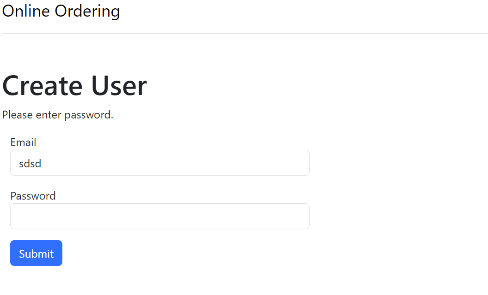

# ordering-ordering
> This is an Online Retail Store themed Educational Spring Boot application made for DePaul University's SE-452 Object-Oriented Enterprise Computing Course. The following students worked on the application:
> - Ismael Fernandez
> - Sebastian Krawiec
> - Dilip Sai Reddy Mettu
> - Jay Kukadiya

## Milestone 1
### High-Level Requirements
The application should have the following functionality:
- Warehouse Functionality:
  - Since this is a school project, we only need a way to display and create warehouses.
  - Displaying and creating warehouse functionality would create enough tasks across the entire application.
  - There will be no updating or deleting warehouse functionality, as this would increase complexity and require much more work. If time allows, additional tasks can be created to implement this functionality.

- Maintain a Catalog of Products:
  - Page to Create a Product:
    - Products need to be stocked in the warehouse.
    - All product data must be entered into the system.
    - Each product should be unique.
  - Page to Update a Product:
    - You can't update information for an already existing product.
    - Updated information must be complete; no empty fields allowed.
  - Page to Delete a Product:
    - A confirmation is needed to confirm the deletion of a product.

- Order Products:
  - Page to Create an Order:
    - A limit should be set on the number of product quantities that can be ordered.
    - Products must be in stock in the warehouse before they can be ordered.
  - Page to Update an Order:
  - Page to Delete an Order:
    - If an order is deleted, we need to ensure that the product is returned to the warehouse.

### Contribution Summary
| Name                  | Contribution                                                                                          |
|-----------------------|-------------------------------------------------------------------------------------------------------|
| Ismael Fernandez      | Create Application base, implemented simple 3 layer architecture. Helped with High-Level Requirements.|
| Sebastian Krawiec     | Created High-Level Requirements.                                                                      |
| Dilip Sai Reddy Mettu | Helped with High-Level Requirements.                                                                  |
| Jay Kukadiya          | Nothing, has not responded to communications.                                                         |

## Milestone 2
### Architecture Agreement
The following team members agree to be graded on an INDIVIDUAL BASIS based on project structure refactoring.
- [X] Ismael Fernandez
- [X] Sebastian Krawiec
- [X] Dilip Sai Reddy Mettu
- [ ] Jay Kukadiya

### Database Diagram


### GitHub Issues Sample


### Discussion of how our Design met the Requirements
Our Design meets the requirements created in Milestone 1 because we have tables to facilitate each unique piece of functionality. We also leverage foreign key constraints to help support some of the requirements. Some examples are in the following tables:
- Users:
  - Can't delete a user if they have orders.
- Products:
  - Can't delete a product if it has stock in a warehouse.
- Orders:
  - Can't delete an order if it has quantities specified in the ```order_products``` table.

Other examples of how our table design supports the requirements include:
  - We have a table ```warehouse_products``` that is able to keep track of how much stock is available to buy from a certain warehouse for each product.
  - We have ```NOT NULL``` constraints set on all columns on the ```products``` table so that we can be sure that all product data is getting entered into the system. If a piece of product information is missing the system from a database level will not allow the record to be inserted into the database.
  - We have a table ```order_products``` that has a column ,```quantity```, for keeping track of the quantities for each product in an order. Based on this column we can validate that the warehouses have enough of that product stocked to complete the order.
  - Orders can't have random statues, each Order must have a status that is predefined in the ```order_status``` table.

### Clean Compile
Application Building Successfully via GitHub Actions


Proof Application Builds via Local Maven Build


### Application Running
Application Running in Docker Container


Database Running Docker Container


Application Home Page


User Index Page


### Contribution Summary
| Name                  | Contribution                                                                                                                                                                                                                                                                                                                                                             |
|-----------------------|--------------------------------------------------------------------------------------------------------------------------------------------------------------------------------------------------------------------------------------------------------------------------------------------------------------------------------------------------------------------------|
| Ismael Fernandez      | Refactored application architecture to lend itself to grading on an individual basis. Created Database ddl and seed scripts. Implemented basic User CRUD functionality. Also started to use GitHub issues for task management for all tasks for all group members. Implemented simple GitHub action to validate all code will build successfully against a common build. |
| Sebastian Krawiec     | Implemented CRUD functionality for the Product Repository allowing for the creation, selection, modification, and deletion of a product to the server's Database.                                                                                                                                                                                                        |
| Dilip Sai Reddy Mettu | Implemented CURD functionality for Order Repository allowing to Create, Update , Read and delete of the order to the server's database.                                                                                                                                                                                                                                  |
| Jay Kukadiya          |                                                                                                                                                                                                                                                                                                                                                                          |

## Milestone 3
The primary focus during this Milestone was to create a UI that would be able to communicate to our persistence layer via a service layer. Some of our UI functionality is supposed by additional processing that was created in our service layer.

### Clean Compile
~ temp ~ 

## Enhanced User Functionality

Trying to add a user with no email or password


Trying to add a user with no email


Trying to add a user with no password


Trying to delete a user with an active order


## Enhanced Product Functionality

Trying to add a product with no name


Trying to add a product with a negative price


### Contribution Summary
| Name                  | Contribution                                                                                                                                                                                                                                                                                                                                                                                                                                                                                                                    |
|-----------------------|---------------------------------------------------------------------------------------------------------------------------------------------------------------------------------------------------------------------------------------------------------------------------------------------------------------------------------------------------------------------------------------------------------------------------------------------------------------------------------------------------------------------------------|
| Ismael Fernandez      | Created warehouse UI to display all warehouses and to create new warehouses. Added validations for user CRUD, can't update a users email to an empty string, can't update an email to an already existing email. Also can't delete a user that has an active order. I even created some basic unit tests for the user service to make sure the user service processing is working correctly. I also updated our GitHub Action to execute unit tests. I also updated the main branch protection rules to also look at unit test. |
| Sebastian Krawiec     | I've created a webpage showcasing all available products and integrated buttons for easy CRUD (Create, Read, Update, Delete) functionality. I've also implemented validations to those buttons to prevent any malformed data being submitted. Specifically, products cannot be removed if there are active orders associated with them. Additionally, new products cannot be added or existing ones updated if there is missing data or if the price is set to a negative value/with text.                                      |
| Dilip Sai Reddy Mettu |                                                                                                                                                                                                                                                                                                                                                                                                                                                                                                                                 |
| Jay Kukadiya          |                                                                                                                                                                                                                                                                                                                                                                                                                                                                                                                                 |
